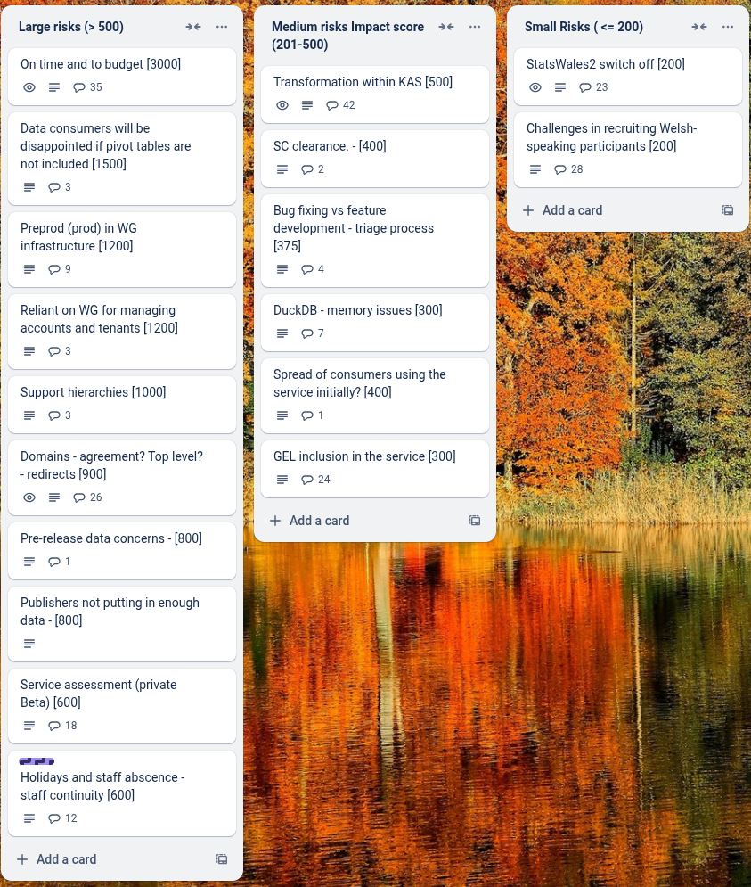

# Sprint 32 - Gecko

## What we did last week

- feature: On dataset overview, "Continue..." link should be first on list
- feature: Remove all categories apart from geography from reference data in SW3
- task: Iterate solution design document to include service optimisation details and latest solution
- task: Reference data policy questions
- task: Analyse feedback from first onboarding cohort
- fix: An unknown error occurred, try again later with preview
- fix: Translation file won't upload 
- fix: Page not found when clicking submit for publishing even though all tasks completed
- fix: preview tab styling
- fix: broken pagination styling since GEL update
- fix: Add background styling to all form pages
- fix: back to top button styling [GEL QA critical]

## What we're planning to do this week

- feature: Move return to tasklist link
- feature: Filters first iteration: Non Javascript version
- feature: Approve a dataset
- task: Plan data table only consumer testing
- task: Prepare discussion guide and testing materials for end-to-end consumer testing
- task: Get reference data
- task: Summarise outputs for the implementation of hybrid pivot tables and hierarchies.
- task: Write tests for existing code to improve test coverage
- task: Map the landscape of data services in Wales
- task: Agree next steps for generating pivots when datasets are ready for publishing
- task: Change builds to use WG and github trigger via PAT
- task: Give devs access to to prod / prepod envs
- task: Create a prod / preprod environment
- task: Arrange final dataset design workshop with publishers
- task: Run Welsh language testing with publishers
- fix: Preview does not work - columns have been ignored

## Goals

These are the goals that we set for this sprint:

- Implement filtering and sorting for consumers _**In progress**_
- Start consumer testing _**In progress**_
- Approve a dataset _**In progress**_
- Get acceptance of a solution design document _**In progress**_
- Prepare for on-boarding of fourth cohort of publishers _**In progress**_

## Risk and Issues

Current table showing project Risks and Issues:

## Show and Tell from last week

[Show and tell 32 - 15 05 2025](https://drive.google.com/file/d/1ugLCympcUBlnN-LEPspe2Mjnn4ltM0fA/view?usp=sharing)

