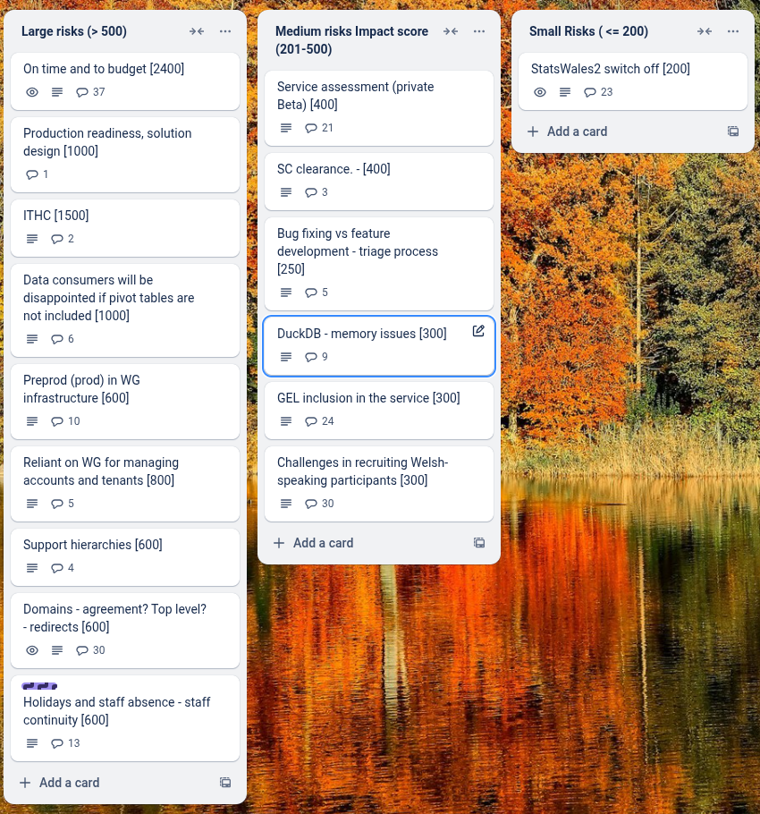
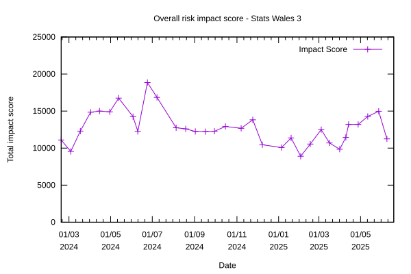

# Sprint 33-mid - Horse

## What we did last week

- task: Onboard publishers cohort 4
- task: Plan data table only consumer testing
- task: Design table sort (cancelling a selected sort)
- task: Document patterns and components
- task: [Spike] Agree strategy for log-in journey
- fix: JWT Cookie size limit exceeded when a member of many groups
- fix: Blank dimension column in preview of table even though all data tasks complete 
- fix: Remove background styling from dataset preview and live dataset
- fix: Number '1' in lookup tables/measure tables being translated in error when toggling to Welsh

## What we're planning to do this week

- feature: Change 'Missing data' for 'x' shorthand to 'Not available'
- feature: Data provider not listed
- feature: Fixes to first pass data table
- feature: Sticky first row
- task: Manual accessibility testing
- task: Prepare for beta assessment
- task: Plan unmoderated end-to-end diary study
- task: Plan unmoderated accessibility testing with WG staff networks
- task: Explore designs for showing custom data value notes in the consumer view
- task: Prepare Marvell environment for consumer testing
- task: Onboard KAS admin for publishers onboarding support
- task: Plan approval testing task for onboarded publishers cohorts 1 and 2
- task: Prepare discussion guide and testing materials for end-to-end UI consumer testing
- task: Get reference data
- task: Write tests for existing code to improve test coverage
- task: Change builds to use WG and github trigger via PAT
- task: Give devs access to to pre-prod environment
- task: Create a pre-prod environment
- task: Review lighthouse report and identify further actions
- task: Run Welsh language testing with publishers
- task: Make our container images more secure
- fix: Data provider and data source do not appear on consumer view
- fix: Error when trying to approve datasets (several affected) even though preview is fine

## Goals

These are the goals that we set for this sprint:

- Implement filtering and sorting for consumers _**In progress**_
- First round of consumer testing _**In progress**_
- Complete ITHC scoping and schedule test _**In progress**_
- Complete on-boarding of fourth cohort of publishers _**In progress**_

## Risk and Issues

Current table showing project Risks and Issues:

Total impact chartered over time

