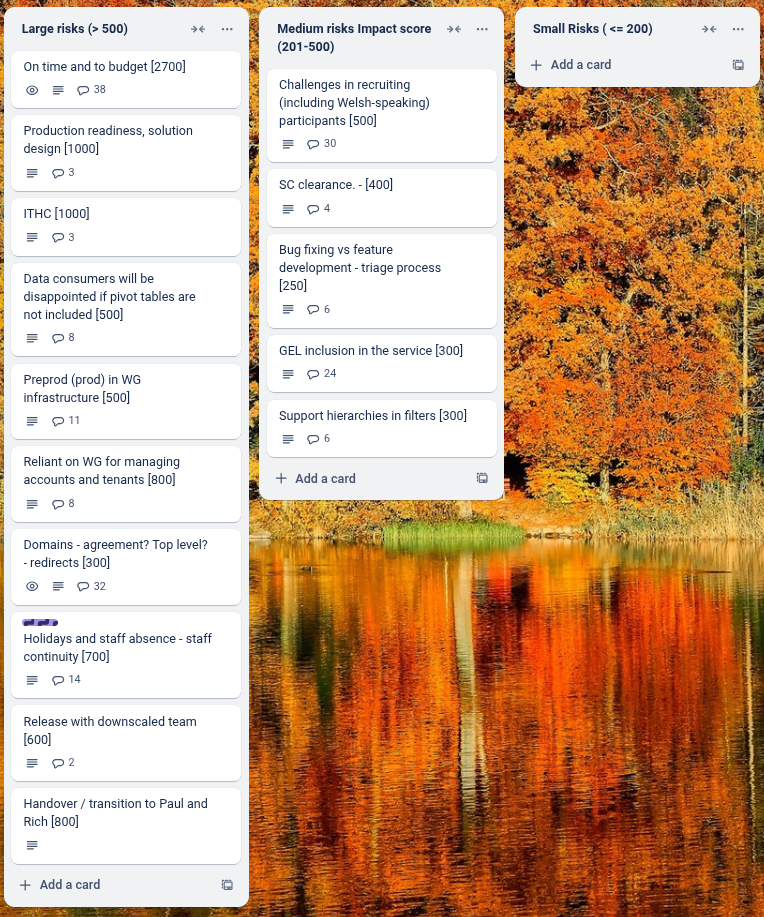

# Sprint 34-mid - Ibex

## What we did last week

- feature: Consumer navigation to API documentation
- feature: Mandate notes column in dataset creation and validate this
- feature: Translate to Welsh for consumer testing
- feature: Implement history tab on dataset overview (publisher)
- feature: Implement find a dataset by browsing taxonomy
- feature: Move return to tasklist link
- feature: Filters first iteration: Non Javascript version
- feature: Hierarchies in filters
- feature: Tabs: "Data" and "About this dataset"
- feature: Filters first iteration: Javascript version
- feature: Consumer data table (basic first version)
- feature: View API guidance
- feature: Access datasets via API
- feature: Validate the languages in lookup tables
- feature: Approve a dataset
- task: Load testing of dev environment -fixes and performance improvements
- task: Service performance measurement framework
- task: Run end-to-end UI consumer testing without sorting or filtered downloads
- task: Proxy API requests through the frontend
- task: Manual accessibility testing
- task: Prepare for beta assessment
- task: Plan unmoderated end-to-end diary study
- task: Explore introductory journey / consumer guidance to StatsWales
- task: Plan design handover
- task: Prepare discussion guide and testing materials for end-to-end UI consumer testing
- task: Hold Beta service assessment
- task: Navigate hierarchies in pivot tables
- fix: Change 'Missing data' for 'x' shorthand to 'Not available'

## What we're planning to do this week

- task: Analyse round 5 of consumer user testing
- task: Export whole translation file for non-guidance screens
- task: Run unmoderated accessibility testing with consumers
- task: Implement Anti-Virus scanning ahead of ITHC
- task: Implement WAF ahead of ITHC
- task: Plan summative round of end-to-end user testing
- task: Explore designs for showing custom data value notes in the consumer view
- task: Give devs access to to pre-prod environment
- task: Create a pre-prod environment
- fix: Two datasets failed to rebuild
- fix: Review logs from manual load test - identify improvements

## Goals

These are the goals that we set for this sprint:

- Prepare the environment for the ITHC _**In progress**_
- Sorting and Filtered downloads _**In progress**_
- Preview release and support for comms for publishers _**Done**_ 
- Attend Beta service assessment _**Done**_

## Risk and Issues

Current table showing project Risks and Issues:

This chart shows the change in total risk impact over time 

