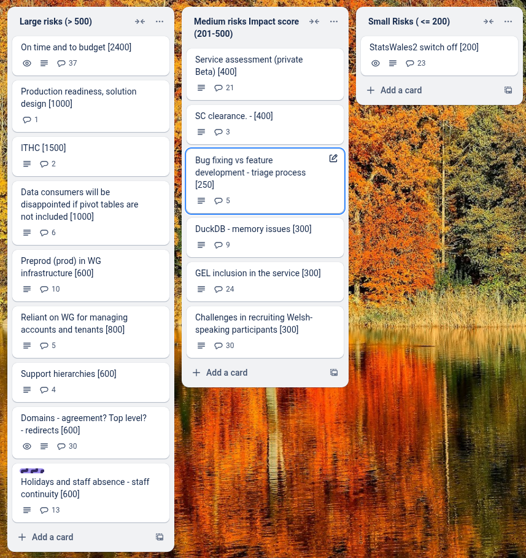

# Sprint 34 - Ibex

## What we did last week

- feature: Write cookies statement
- task: Plan unmoderated accessibility testing with WG staff networks
- task: Prepare Marvell environment for consumer testing
- task: Onboard KAS admin for publishers onboarding support
- task: Design how publishers view geography reference data
- task: Design exception journeys for geography and date reference data
- task: Design search for dataset (publisher) / user (admin)
- task: Get reference data
- task: Design table sort (cancelling a selected sort)
- task: Design archived dataset (consumer side)
- task: Document patterns and components
- task: Run accessibility testing with publishers
- task: [Spike] Agree strategy for log-in journey
- fix: Filter fixes to consumer view for testing 13th June
- fix: Data provider and data source do not appear on consumer view
- fix: Error when trying to approve datasets (several affected) even though preview is fine
- fix: Translation file export/import task status issues
- fix: replace instances of javascript:history:back
- fix: Remove background styling from dataset preview and live dataset
- fix: Dataset not exporting all English dimension names
- fix: Ignoring this column in the data table led to an error
- fix: Preview does not work - columns have been ignored
- fix: Incomplete status labels on completed translation sections
- fix: Data table task shows as completed even though column types have not been assigned yet
- fix: Publisher preview does not show selected source
- fix: Uploading a dataset on underground stations clicking on links from the tasklist results in "Page Not found"
- fix: Data source added not visible in dataset preview
- fix: Measure look up error 'NaN' = not a number message
- fix: Back history after incorrectly matched date dimension

## What we're planning to do this week

- feature: Data provider not listed
- feature: Fixes to first pass data table
- task: Run unmoderated accessibility testing with consumers
- task: Manual accessibility testing
- task: Prepare for beta assessment
- task: Implement Anti-Virus scanning ahead of ITHC
- task: Plan unmoderated end-to-end diary study
- task: Explore designs for showing custom data value notes in the consumer view
- task: Plan design handover with Andy Fox
- task: Prepare discussion guide and testing materials for end-to-end UI consumer testing
- task: Summarise outputs for the implementation of hybrid pivot tables and hierarchies.
- task: Write tests for existing code to improve test coverage
- task: Agree next steps for generating pivots when datasets are ready for publishing
- task: Give devs access to to pre-prod environment
- task: Create a pre-prod environment
- task: Review lighthouse report and identify further actions
- task: Run Welsh language testing with publishers

## Goals

These are the goals that we set for this sprint:

- 1. Prepare the environment for the ITHC _**In progress**_
- 2. Sorting and Filtered downloads _**In progress**_
- 3. Preview release and support for comms for publisher _**In progress**_
- 4. Attend Beta service assessment _**In progress**_

## Risk and Issues

Current table showing project Risks and Issues:

## Show and Tell from last week

[Show and tell 34 - 12 06 2025](https://drive.google.com/file/d/1RmAIA5s8cAnbZQuUFv7xfGObtf1Sv8pB/view?usp=sharing)

