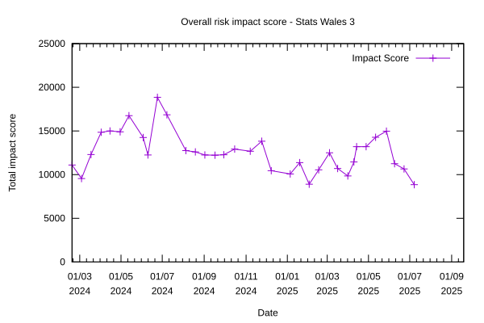

# Sprint 35 - Jackalope

## What we did last week

- feature: Filter selection counter (JS only)
- feature: Batch select / deselect filters
- feature: Filter iterations after initial consumer testing
- feature: Adding missing data value shorthand to the system
- feature: Implement page for filtered data download
- feature: Support multiple providers for the same user account
- task: Follow up missing percentages for 'All Pupils' in preview dataset
- task: Review CORS policy and implement any required settings on Frontend & Backend
- task: Analyse unmoderated accessibility testing with consumers results
- task: Share look up instructions for preparing standardised reference data for implementation
- task: Run unmoderated accessibility testing with consumers
- task: Plan summative round of end-to-end user testing
- task: Add CSRF protection
- task: Look at using ts-node-dev instead of node-mon
- task: [SPIKE] Publish journey should be resumable and shareable at any point
- task: Better error handling on the frontend
- task: Implement a URL builder for the frontend
- fix: Explore why two datasets failed to rebuild

## What we're planning to do this week

- feature: Iterate reference data for hierarchies  [KAS]
- feature: Iterate geography reference data following user feedback [KAS]
- task: Identify monitoring research questions
- task: Run summative round of consumer end-to-end testing
- task: Plan service handover to WG
- task: Iterate future product roadmap for handover
- task: Implement WAF ahead of ITHC
- task: Explore designs for showing custom data value notes in the consumer view
- task: Give devs access to to pre-prod environment
- task: Create a pre-prod environment
- fix: Overlap styling issue on rows per page select box

## Goals

These are the goals that we set for this sprint:

- Prepare and support for ITHC _**In progress**_
- Address fixes in update journey _**In progress**_
- Download metadata _**In progress**_
- Prepare for support and service handover _**In progress**_

## Risk and Issues

Current table showing project Risks and Issues:

![A Trello-style digital board showing categorized project risks divided into three columns: 'Large risks (> 500)', 'Medium risks Impact score (201–500)', and 'Small Risks (<= 200)'. The 'Large risks' column contains several high-impact issues such as 'On time and to budget' and 'Production readiness, solution design '. The 'Medium risks' column includes items like 'Challenges in recruiting (including Welsh-speaking) participants' and 'SC clearance'. The 'Small Risks' column is empty. The background features a scenic lake with vibrant autumn trees reflected in the water.](risksBoard20250707.png)

Risks and issues impact chart

