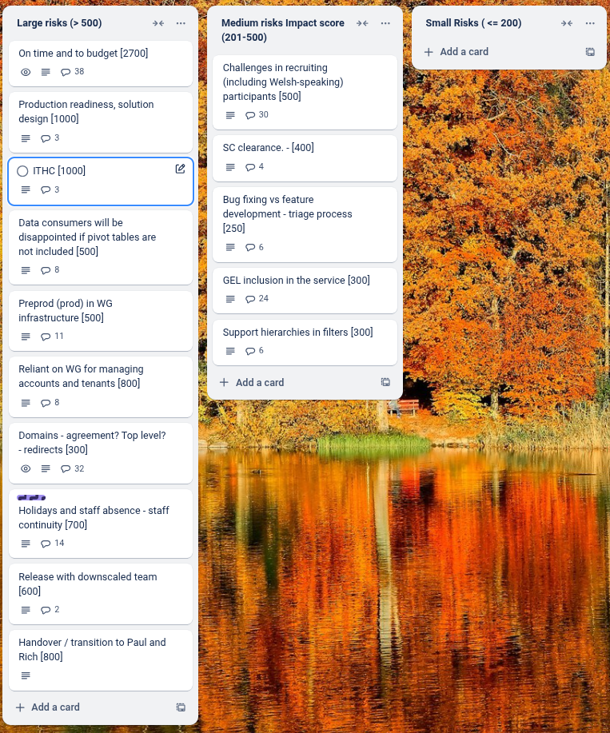

# Sprint 35 - Jackalope

## What we did last week
## What we did last week

- feature:Sticky first row
- task: Analyse round 5 of consumer user testing
- task: Load testing of dev environment -fixes and performance improvements
- task: Task: Understand what we need to do to meet point 1 of the Welsh service standard: "Focus on the current and future wellbeing of people in Wales"
- fix: Filter fixes - JS, Non-JS and hierarchies

## What we're planning to do this week

- feature: Download in JSON format
- feature: Implement page for filtered data download
- task: Plan service handover to WG
- task: Run unmoderated accessibility testing with consumers
- task: Implement WAF ahead of ITHC
- task: Plan summative round of end-to-end user testing
- task: Explore designs for showing custom data value notes in the consumer view
- task: Give devs access to to pre-prod environment
- task: Create a pre-prod environment
- fix: Overlap styling issue on rows per page select box
- fix: Explore why two datasets failed to rebuild
- fix: Review logs from manual load test - identify improvements

## Goals

These are the goals that we set for this sprint:

- Prepare and support for ITHC _**In progress**_
- Address fixes in update journey _**In progress**_
- Download metadata _**In progress**_
- Prepare for support and service handover _**In progress**_

## Risk and Issues

Current table showing project Risks and Issues:

## Show and Tell from last week

[Show and tell 35 - 26 06 2025](https://drive.google.com/file/d/1Edl5gme33HEKmBuydPG444L7CU-OaZQz/view?usp=sharing)
