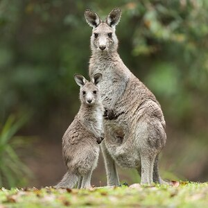
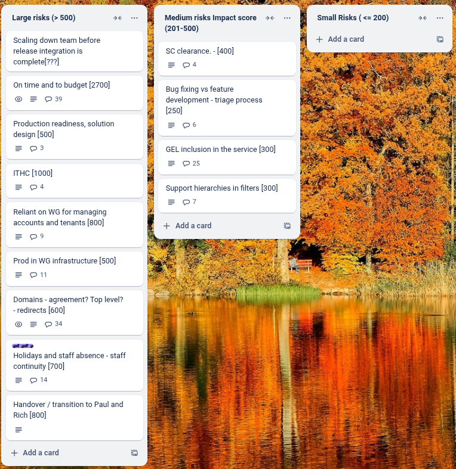

# Sprint 36 - kangaroo

## What we did last week

- task: Confirm whether variable values that didn't exist in the past should have data values with 'not applicable' added when they are used in for later statistics
- task: Add HTTP Strict-Transport-Security header to tell the browser to always use HTTPS
- task: Return method not allowed for non-GET requests on the public api
- task: Implement Anti-Virus scanning ahead of ITHC
- task: Implement WAF ahead of ITHC
- task: Give devs access to to pre-prod environment
- task: Create a pre-prod environment
- task: Make our container images more secure
- fix: Move dataset between groups is broken on dev and preview environments
- fix: Unknown error when applying filters and a sort is already applied
- fix: Month in the Welsh version of the consumer view is still in English
- fix: Filter styling issues
- fix: Overlap styling issue on rows per page select box
- fix: Accessibility fix: Unhelpful error messages on column selection screen
- fix: Dimension: Row sample text incorrect

## What we're planning to do this week

- feature: Schedule GEL review of data consumer user interface
- feature: Changing content, input and underlying logic for update frequency
- feature: Iterate reference data for hierarchies  [KAS]
- feature: Iterate geography reference data following user feedback [KAS]
- task: Identify monitoring research questions
- task: Run summative round of consumer end-to-end testing
- task: Plan service handover to WG
- task: Iterate future product roadmap for handover
- task: Explore designs for showing custom data value notes in the consumer view
- fix: Error when trying to add data to update a dataset
- fix: Fix focus states [GEL QA critical]

## Goals

These are the goals that we set for this sprint:

- Release of the update user journey fixes _**In progress**_
- Improve time reference data _**In progress**_
- Deal with sorting and filtering issues _**In progress**_
- Support ITHC _**In progress**_

## Risk and Issues

Current table showing project Risks and Issues:

## Show and Tell from last week

*We didn't record this session because we forgot - here is a link to the presentation*
[Show and tell 35 - 10 07 2025](ShowAndTell35_20250710.pdf)

