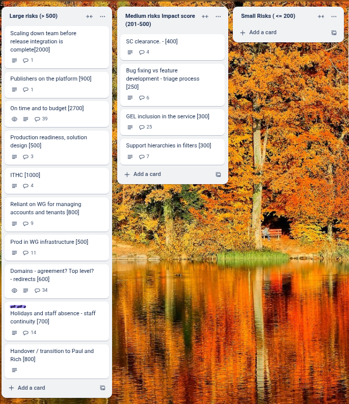
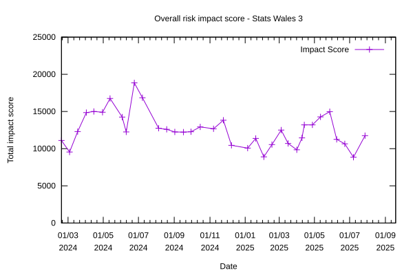

# Sprint 37 - Lemur

## Things to bear in mind

There was no weekly report last week

## What we did last week

- feature: Improve logic for revised updates to data values
- feature: Include type of update selected as heading in data table task in update journey
- feature: Schedule GEL review of data consumer user interface
- feature: Error when uploading a large data table
- feature: Mandate the use of a measure when we ask what does each column in the data table contain
- feature: Deploy the consumer and publisher sites as separate containers, and route them via different subdomains
- feature: Clear all filters
- feature: Accessibility fix: Focus visibility fails WCAG throughout service
- feature: Accessibility fix: When using keyboard navigation 'About this dataset' tab on consumer view is skipped
- feature: Accessibility fix: Page titles across publisher and consumer should include h1
- feature: Make it more obvious what group a dataset is in
- feature: Changing content, input and underlying logic for update frequency
- feature: Adding missing data value shorthand to the system
- feature: Fixes to first pass data table
- feature: Download in JSON format
- feature: Reference data hierarchies - time periods within time periods
- feature: Column sort table
- feature: Add support for rolling start dates to the type of year picker and backend
- feature: Feedback on upload of files (loading spinner)
- feature: Add sensible html titles to each page
- task: Prepare consumer usability log for handover
- task: Identify monitoring research questions for consumers
- task: Run summative round of consumer end-to-end testing
- task: Plan service handover to WG
- task: Document service support model
- task: Document the filtering and sorting of the API in Swagger
- task: Add guidance on how to name data description values
- task: Export whole translation file for non-guidance screens
- task: Make backend test suite parallelizable for speed
- task: Remove dev dependencies / tests from prod images
- fix: When selecting the 'Developer' tab I get 'an unknown error occurred'
- fix: Replace all validation error
- fix: Dataset preview link on approval page should open in a new tab
- fix: Check the data table page's preview table has pagination that misses rows
- fix: Bug in title of approval page
- fix: Data table task says it's complete when it is not
- fix: YYYYmmm does not show as described in the guidance using standardised dates
- fix: Identify and resolve issues around database connections
- fix: Some filter items do not appear in filter box even though they are in the data table
- fix: Preview environment still has the bug from when JS was removed so tabs don't appear etc.
- fix: No notes appear in the notes column when there are multiple note codes
- fix: Error uploading add only update data table file
- fix: Date formatting does not work for year format YYYYY with months and quarters
- fix: Updated dataset publishing date passed but dataset status is scheduled for publishing
- fix: When clicking on a related report link in the related report task it errors as Page not found
- fix: Error when trying to approve dataset on update journey
- fix: Publisher cannot complete the measure look up [Gareth Thomas]
- fix: Sorting does not work on data value numbers
- fix: Translation file appears to upload successfully but when pressing continue it errors and the task does not complete
- fix: Built in calendar month only shows year not month
- fix: Error when trying to add data to update a dataset
- fix: Error when replacing all existing data
- fix: Unable to update look up table in update user journey
- fix: Update journey for add data only has bug errors.fact_table_validation.unknown_error
- fix: Taxonomy subtopics not in alphabetical order
- fix: Accessibility fix: Missing or invalid IDs on filter checkboxes on consumer dataset view
- fix: Accessibility fix: No error validation on 'Download' tab of consumer view
- fix: Accessibility fix: 'Rows per page' box on consumer dataset view overlaps table on smaller screens
- fix: Fix focus states [GEL QA critical]
- fix: Fix footer issues [GEL QA critical]
- fix: Page not found when clicking submit for publication even though all tasks complete
- fix: Error for data table when replacing all data in update user journey
- fix: Preview 'Published by' displays 'Not entered yet' but they have been

## What we're planning to do this week

- feature: Add an option for revising data without automated note codes
- feature: Include dimension refcodes in download files as additional columns next to corresponding descriptions
- feature: Feedback form for publishers [Public Beta]
- task: Prepare publisher usability log for handover
- task: Get translations for new / changed content
- task: Explore: see hierarchical information in download
- task: Iterate future product roadmap for handover
- task: Discuss disaster recovery plan
- fix: "You do not have permission to access this page to view a published dataset' when sorting a data column
- fix: When changing dimension from unstandardised to standardised ref data (date) in update journey the label stayed as unchanged
- fix: Add error message for user that there are incomplete facts after column assignment of create data table

## Goals

These are the goals that we set for this sprint:

- Fix critical bugs  _**In progress**_
- Remediate all ITHC issues _**In progress**_
- Implement improved logic to the update user journey and add an extra option _**In progress**_
- Secure authority to operate _**In progress**_

## Risk and Issues

Current table showing project Risks and Issues:

Risks and issues profile

