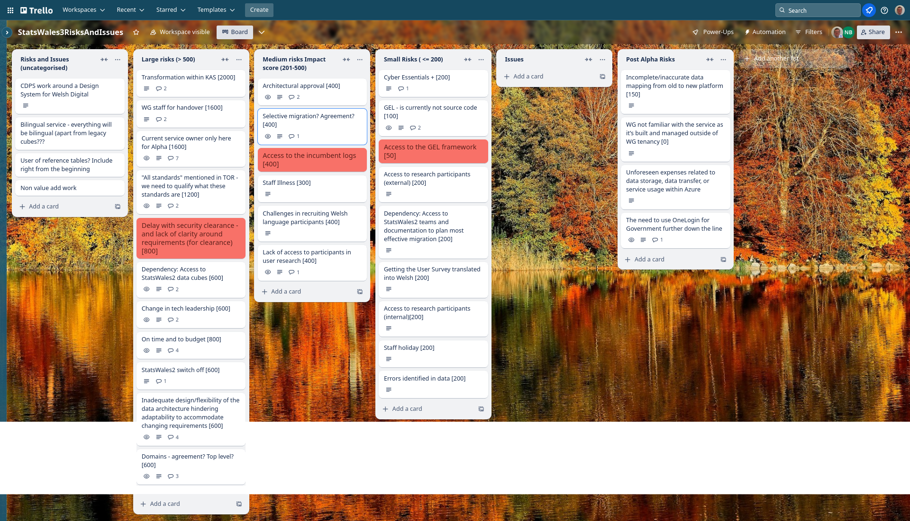

## What we did last week
- Spike - explore Reference data and linking - data modelling and standardisation:

## What we're planning to do this week
- Create metadata database and link to assets in datalake
- Reference data - controlled vocabularies such as local authority codes
- Prepare new data consumer participant list
- Implementation of Internationalisation
- Create summary document of 1st round testing

## Goals
- Iterate data processor's user journeys (User Research and Design)_**In progress**_
- Create metadata database and link to assets in data lake (data and development) _**In progress**_
- Internationalisation (data and development) _**In progress**_

## Things to bear in mind / What's blocking us
We are still being blocked by these two issues - although we hope to make some progress today
- Cyber essentials plus certification
- Assess to Stats Wales Data cubes

## Screen shot of risks and issues board

