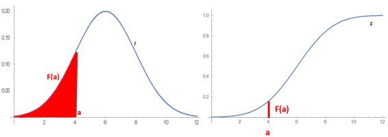
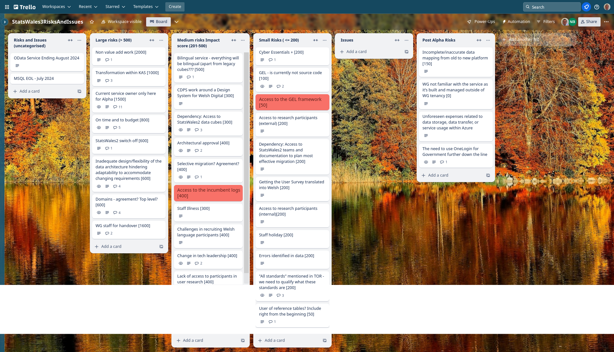
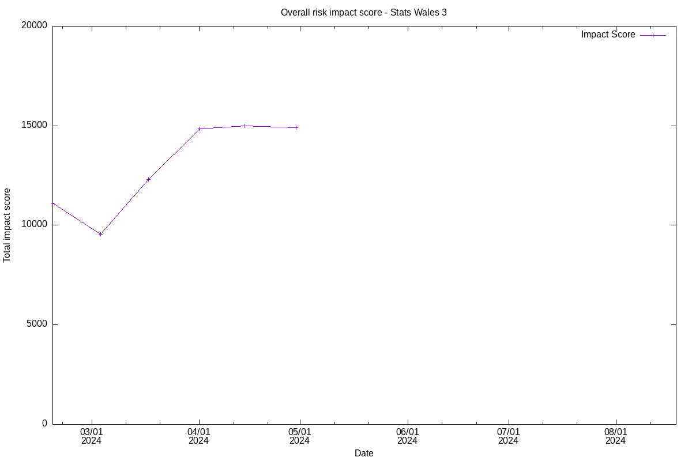

## What we did last week
- Create prototype (iteration 2) for data processor/ publisher
- Hold second round of prototype testing sessions
- Reference data - controlled vocabularies such as local authority codes

## What we're planning to do this week
- Access for full data cubes for Statswales2 [ON HOLD 18/04/2024]
- Recommending our approach for Beta / Alpha report
- In the run-up to the beta phase, we will begin horizon scanning
- SOW and Milestones - documentation required in support of Beta
- Data consumer - Prototype (iteration 2)
- Alpha assessment
- Data publisher round 2 testing - research analysis prep & workshop 

## Goals
These are the goals that we agreed in planning:
- Complete the data processor user testing round 2 _**Done**_
- Complete Alpha / Beta report (and SOW Beta) _**In progress**_
- Break the alpha service into components _**Done**_

## Things to bear in mind / What's blocking us
- We conducted the first half of the Alpha assessment another session is scheduled for Friday

The following things are still blocking us, although progress is being made:
- Access to the data discussions are happening today to get access to the data
- Agreement on access for Marvell subcontractors Register Dynamics are going the process of being audited for Cyber Essentials Plus
- Architecture form - Azure subscriptions - a draft of this form will be shared with WG technical staff today

## Screen shot of risks and issues board

