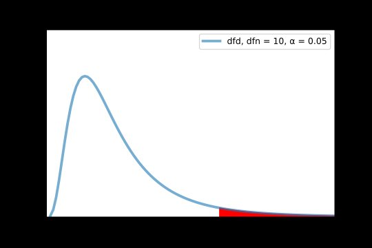
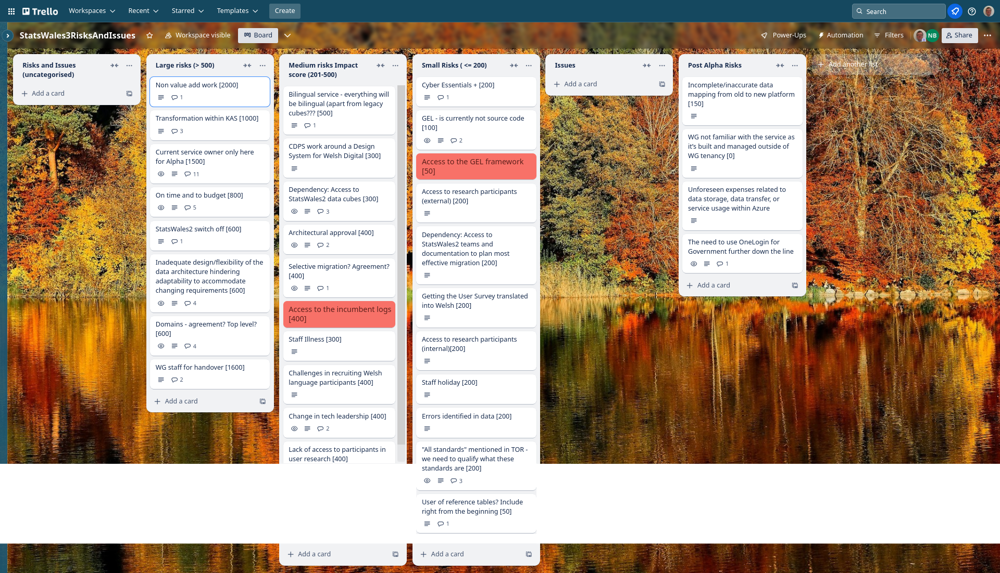

## What we did last week
* Create metadata database and link to assets in datalake (Goal)
* Implementation of Internationalisation 
* Create summary document of 1st round testing
* Advertise user consumer survey more widely

## What we're planning to do this week
* Start to implement GEL into the service
* Hold second round of prototype testing sessions - data processor / publisher)
* Common data types and their encodings for example, geo-spatial data, cost/price data or population measures - beta?
* Hold second round of prototype testing with data consumers
* Break apart the monolith into smaller services
* Authentication around the service

## Goals
These are the goals that we set for this sprint:
* Complete the data processor user testing round 2 _**In progress**_
* Complete Alpha / Beta report (and SOW Beta) _**In progress**_
* Break the alpha service into components _**In progress**_

## Things to bear in mind / What's blocking us
The following things are still blocking the progress of the project
* Access to the data 
* Agreement on access for Marvell subcontractors
* Architecture From - Azure subscriptions

## Screen shot of risks and issues board

