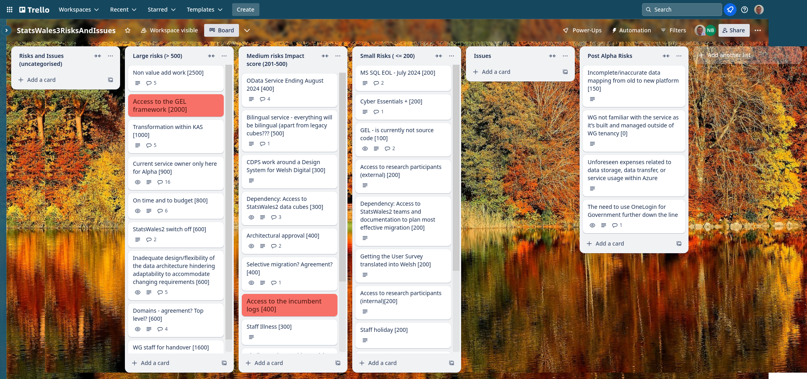
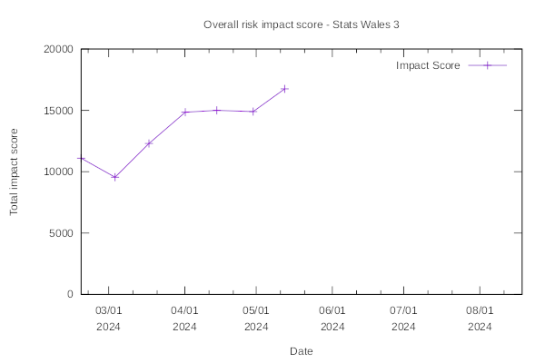

## What we did last week
* Update user needs board based on research findings
* Break apart the monolith into smaller services
* Analyse finds from current round of user reearch
* Decide what we're going to test next - identify iteration 3
* Alpha assessment
* Data publisher round 2 testing - research analysis prep & workshop 
* Conduct user research analysis of data processors - Round 2
* Onboarding new designer

## What we're planning to do this week
* Access for full data cubes for Statswales2 [ON HOLD 18/04/2024]
* Understand the variety of data sources
* SOW and Milestones - documentation required in support of Beta
* Solution Design Document
* Attempt to implement OData api on the backend app
* Understanding the domain process Simon (GEL)
* Iterate data publishing content journey (prototype) - Version 3
* Aligning roadmap and release plan

## Goals
These are the goals that we agreed in planning:
- Refine the Beta backlog In progress _**In progress**_
- Start migration to Welsh Gov Azure In progress _**In progress**_
- Plan next round of research with data publishers _**In progress**_

## Things to bear in mind / What's blocking us
- Today it was agreed in project board that the project had passed its Alpha assessment

The following things are still blocking us, although progress is being made:
- Access to the data -  **we have now received invitations for accounts to access the data**
- Agreement on access for Marvell subcontractors **Register Dynamics are going the process of being audited for Cyber Essentials Plus**
- Architecture form - **this has been discussed and issues that were raised are being addressed, we still do not yet have access to the subscriptions that we need**

## Screen shot of risks and issues board

