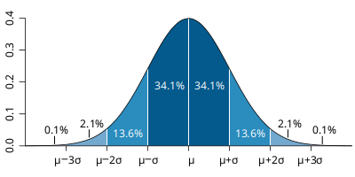
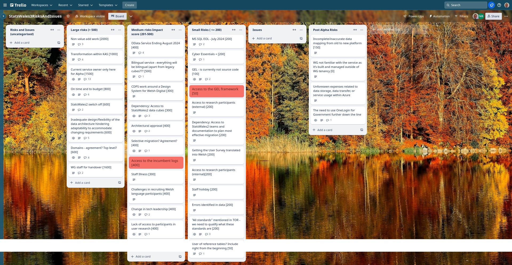

## What we did last week
* Investigating methods to help data publishers clean and validate their datasets at upload time to increase the value of the platform as a whole - dependency on data cubes
* Hold second round of prototype testing sessions - data processor / publisher)
* In the run-up to the beta phase, we will begin horizon scanning to identify constraints to release for the beta phase such as security checkpoints, approval processes, interfacing with other services/teams, etc.
* Content review of current prototypes
* Access for full data cubes for Statswales2
* Data consumer - Prototype (iteration 2)

## What we're planning to do this week
* SOW and Milestones - documentation required in support of Beta
* Continue analysis of 2nd round research output
* Create to-be service map first iteration
* Fine tune data publishing user journey (design)
* Complete the Solution Design Document Form

## Goals
These are the goals that we set for this sprint:
* Refine the Beta backlog _**In progress**_
* Start migration to Welsh Gov Azure _**In progress**_
* Plan next round of research with data publishers _**In progress**_

## Things to bear in mind / What's blocking us
The following things are still blocking the progress of the project
* Access to the data ***We downloaded all the StatsWales2 OData (1377 datacubes) which we are currently analysing while we await access to the source data.***
* Access to the source data - ***we are currently waiting for security re-clearance in order to get access to the data***
* Agreement on access for Marvell subcontractors - ***Our subcontractors are in the process of getting the required certification***
* Architecture form - Azure subscriptions - ***we are responding to comments on our service design document, but we don't anticipate that this will now stop us getting access***

## Screen shot of risks and issues board

