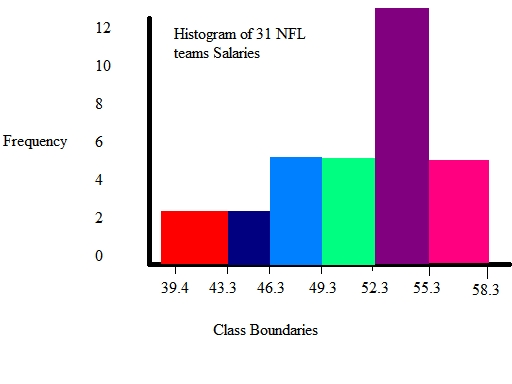
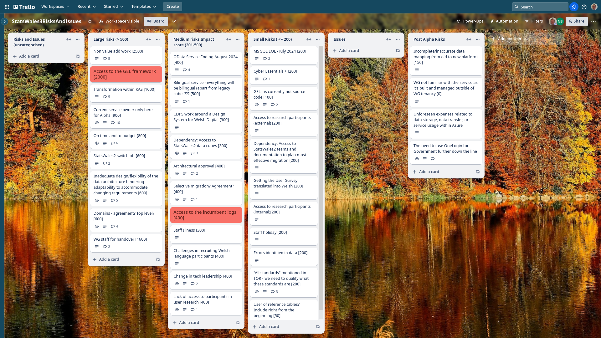

## What we did last week
* Access full data cubes for StatsWales 2
* Create SOW and Milestones document for Private Beta
* Decide scope for the iteration 3 with publishers
* Conduct user research analysis of data processors  / publishers - Round 2
* Prep for project board - highlight report
* Create first iteration of TO-BE journey map for publisher
* Iterate data publishing content journey - prototype version 3 
* User research housekeeping of participant lists for Private Beta
* Transfer materials from Objective Connect to our shared drive
* Plan third round of testing with publishers
* Exploration session into notes

## What we're planning to do this week
- Implement 'Choose a dataset to upload'
- Understand the variety of data sources
- Get access to WG estate
- Finalise Solution Design Document
- Understand the needs being met by the current OData service
- Implement 'Create a new dataset' page 
- First iteration of TO-BE user flow for create dataset
- Align roadmap and release plan
- [SPIKE] Explore if there is more than one data field in a StatsWales 2 cube
- Understand and reconcile geographical coverage options
- Implement 'Name the dataset'
- Analyse Stats Wales 2 data
- Prepare prototype V3 for testing with publishers

## Goals
These are the goals that we agreed in planning:
- Refine the Beta backlog In progress _**In progress**_
- Start migration to Welsh Gov Azure In progress _**In progress**_
- Plan next round of research with data publishers _**In progress**_

## Things to bear in mind / What's blocking us
Things to bear in mind / What’s blocking us
The following things are still blocking us, although progress is being made:
- Agreement on access for Marvell subcontractors ***Register Dynamics are going the process of being audited for Cyber Essentials Plus***
- Architecture form - ***this has been discussed and issues that were raised are being addressed, we still do not yet have access to the subscriptions that we need***
- We now have access to SW2 data cubes.

## Screen shot of risks and issues board

