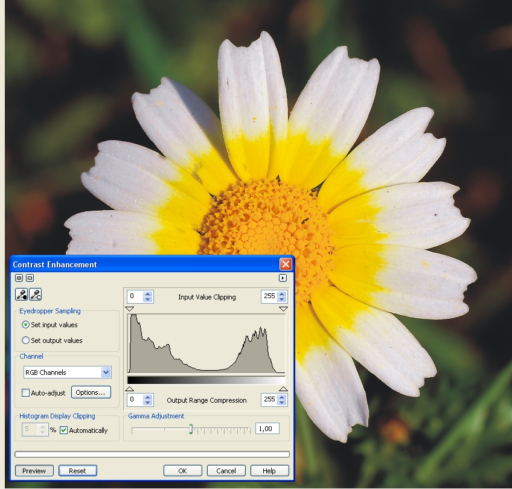
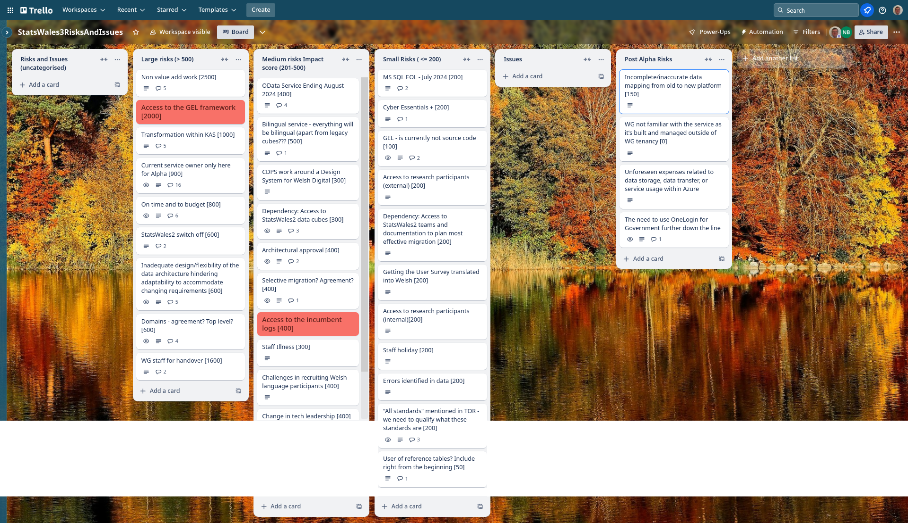

## What we're planning to do this week
* Access for full data cubes for Statswales2 [ON HOLD 18/04/2024]
* Understand the variety of data sources
* SOW and Milestones - documentation required in support of Beta
* Solution Design Document
* Intro page
* Create first iteration of TO-BE journey map
* Iterate data publishing content journey (prototype) - Version 3
* User research housekeeping 
* Aligning roadmap and release plan
* Is there more than one data field in a current statsWales cube
* Understand and reconcile geographical coverage options

## Goals
These are the goals that we set for this sprint:
* Refine the Beta backlog _**In progress**_
* Start migration to Welsh Gov Azure _**In progress**_
* Plan next round of research with data publishers _**In progress**_

## Things to bear in mind / What's blocking us
The following things are still blocking the progress of the project
* Access to the source data - ***We hope that some members of the team will have access to the data today***
* Agreement on access for Marvell subcontractors - ***Our subcontractors are in the process of getting the required certification***
* Architecture form - Azure subscriptions - ***We are still responding to comments on the service design documents, we do not currently have access***

## Screen shot of risks and issues board

