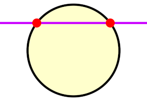
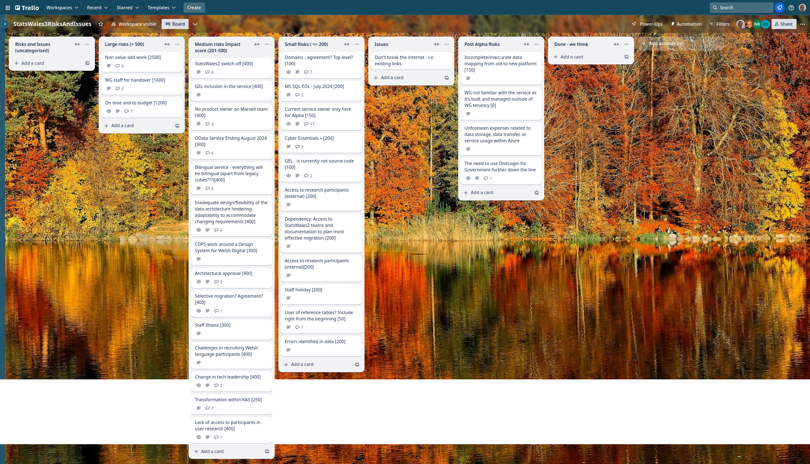
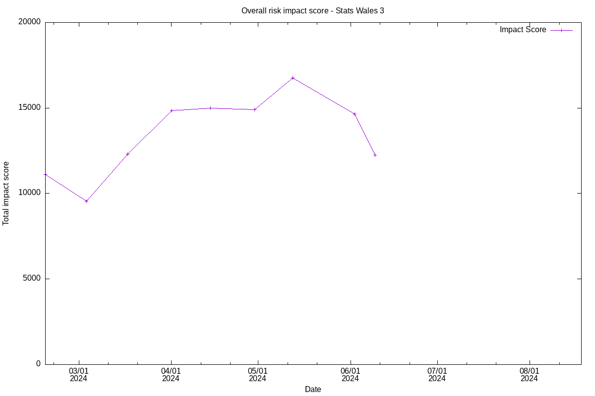

Weekly report
=============

What we did last week
---------------------

- Start to understand the needs being met by the current OData service
- Connect prototype designs with stories
- Use SW2 data to build prototype data for testing new system
- Respond to Jack (CDPS) regarding data standards
- Plan engagement for Welsh Statistical Liaison Committee event (5th
    June)
- Welsh statistical liaison committee meeting (WSLC)
- Plan for project board - Monday 10th
- Adjust the build pipeline

What we're planning to do this week
-----------------------------------

- Implement 'Choose a dataset to upload
- Understand the variety of data sources
- Finalise Solution Design Document
- Implement 'Create a new dataset' page
- Align roadmap and release plan
- Understand and reconcile geographical coverage options
- Implement auth into relevant services
- Model a mock data cube - Architecture
- High-level plan for user research in Beta
- \[SPIKE\] Gel React components
- Implement 'Name the dataset'
- Analyse Stats Wales 2 data
- Register Dynamics - Cyber Essentials Plus
- Testing prototype round 3 - with publishers
- Data audit for data migration
- Data domain model
- Analyse findings from 'Browse by topic' exercise with data consumers

Goals
-----

These are the goals that we set for this sprint:

- Complete testing of prototype round 3 with publishers
 _**In progress**_

- Implement Auth on the beta application
 _**In progress**_

Things to bear in mind / What's blocking us
-------------------------------------------

The following things are still blocking the progress of the project

- Access to the source data

***We are exploring another approach to getting a copy of the data for
which we hope to get approval***

- Agreement on access for Marvell subcontractors

***We are reviewing with our subcontractors the oustanding points that
resulted from the Cyber Essentials Plus audit*** - Architecture form -
Azure subscriptions

***We have a meeting with the architect's office to review the current
Service Description Document***

Screen shot of risks and issues board
-------------------------------------

