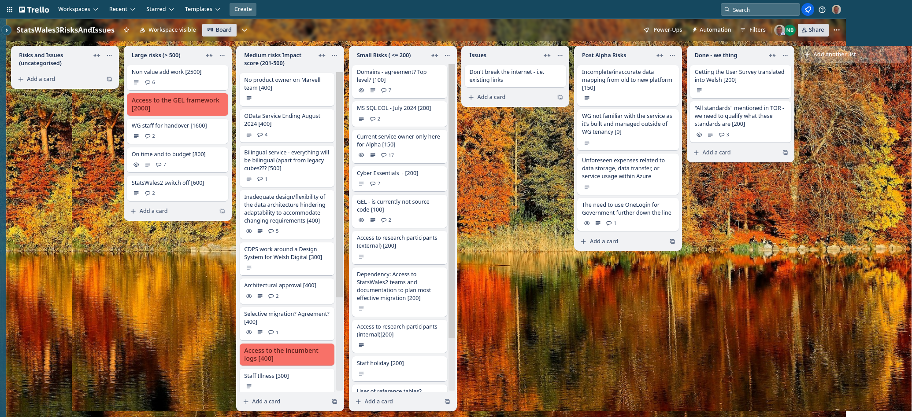

# Weekly report

## What we did last week

- Get access to WG estate
- First iteration of TO-BE user flow for create dataset
- Prepare prototype V3 for testing with publishers

## What we're planning to do this week

- Implement 'Choose a dataset to upload'
- Finalise Solution Design Document
- Start to understand the needs being met by the current OData service
- Implement 'Create a new dataset' page
- Align roadmap and release plan
- Model a mock data cube - Architecture Data & Design
- High-level plan for user research in Beta
- Implement 'Name the dataset'
- Analyse Stats Wales 2 data
- Plan engagement for Welsh Statistical Liaison Committee event (5th June)
- Register Dynamics - Cyber Essentials Plus
- Testing prototype round 3 - with publishers

## Goals

These are the goals that we set for this sprint:

- Complete testing of prototype round 3 with publishers

_**In progress**_

- Implement Auth on the beta application

_**In progress**_

## Things to bear in mind / What's blocking us

The following things are still blocking the progress of the project

- Access to the source data

 ***We are exploring another approach to getting a copy of the data for which we
 hope to get approval today***
- Agreement on access for Marvell subcontractors

***Our subcontractors are in the process of getting the required certification***
- Architecture form - Azure subscriptions

***We are still responding to comments on the service design documents, we do not
 currently have access***

## Screen shot of risks and issues board

