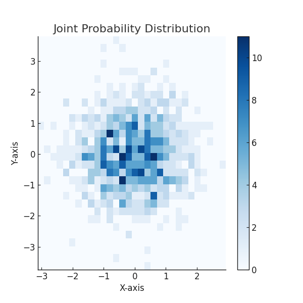
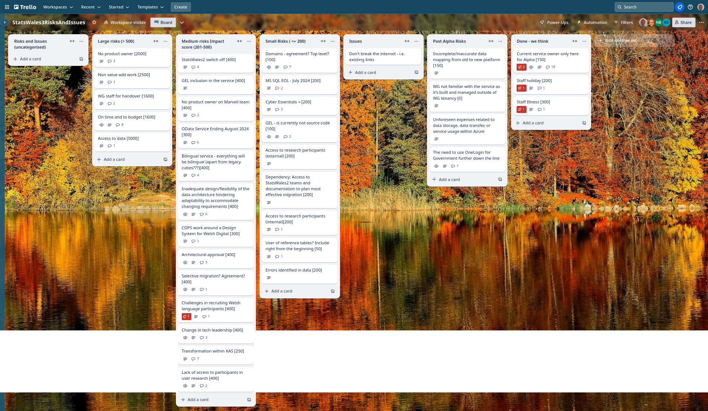
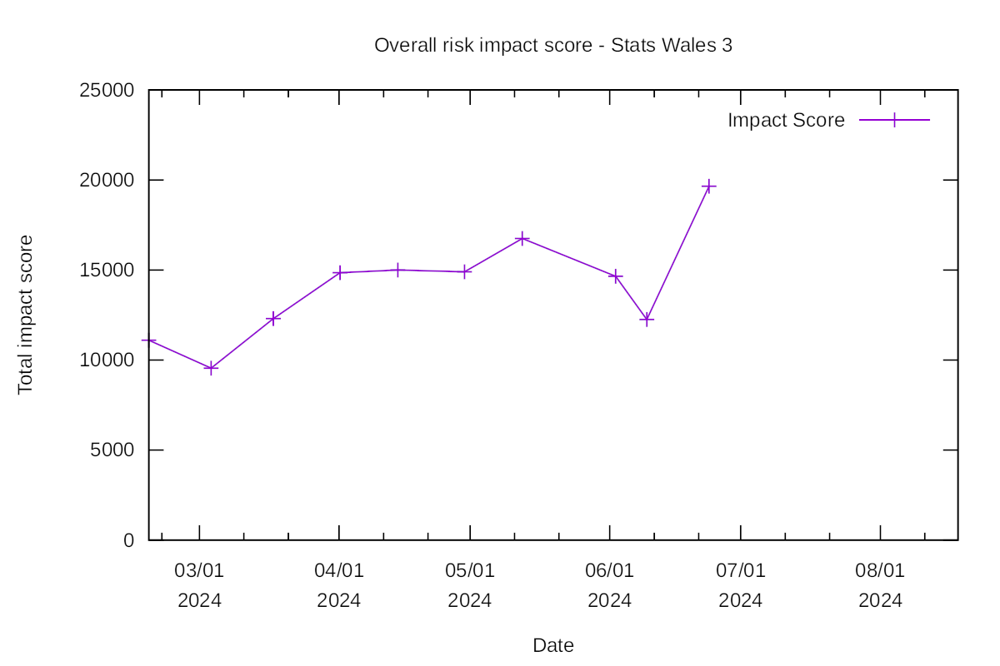

Weekly report
=============

What we did last week
---------------------
- Conduct data consumer survey analysis

What we're planning to do this week
-----------------------------------
- [SPIKE] Data access strategy
- Recommendations and next steps from round 3 testing
- Analyse findings from 'Browse by topic' exercise with data consumers
- Data domain model
- Data audit for data migration
- Register Dynamics - Cyber Essentials Plus
- Hold workshop to review toolkit for bilingual software and develop action plan
- [SPIKE]  Gel React components
- High-level plan for user research in Beta
- Investigate missing values in SW2 - and map out TO - BE (Data & Design)
- Implement auth into relevant services

Goals
-----

These are the goals that we set for this sprint:

- Authorisation for the service (development)
 _**In progress**_

- Settle on a design for footnotes, notes, missing values, provisional data 
(research and design) _**In progress**_

- Start to understand the update journey (research and design)
 _**In progress**_

Things to bear in mind / What's blocking us
-------------------------------------------

The following things are still blocking the progress of the project

- Access to the source data

***We are exploring another approach to getting a copy of the data for
which we hope to get approval***

- Agreement on access for Marvell subcontractors

***We have booked a Cyber Essentials Plus Audit***
- Architecture form - Azure subscriptions

***We are waiting for the go ahead for this after discussions around the Service
 Desciption Document***

Screen shot of risks and issues board
-------------------------------------

