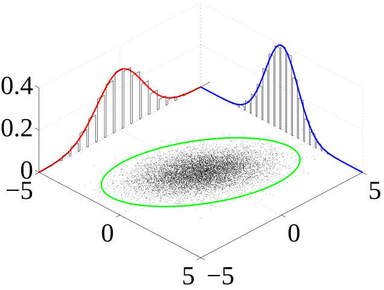
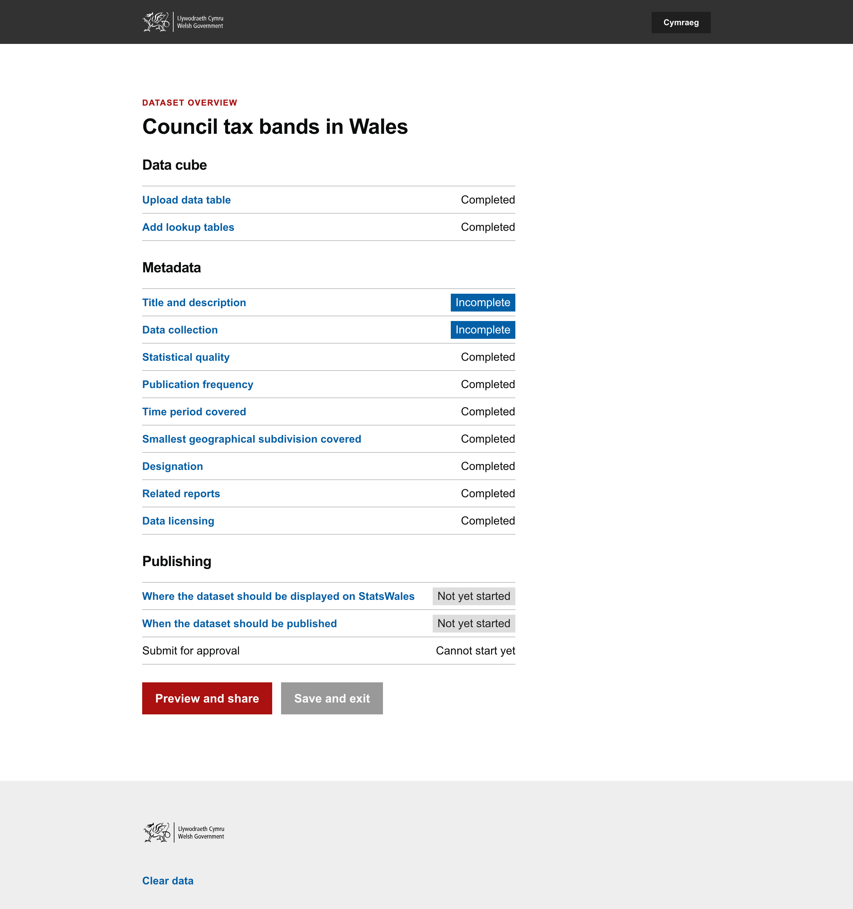

Weekly report
=============

What we're planning to do this week
-----------------------------------

- Analyse findings from 'Browse by topic' exercise with data consumers
- Data domain model
- Data audit for data migration
- Register Dynamics - Cyber Essentials Plus
- Investigate missing values in SW2 - and map out TO - BE (Data & Design) Consumers
- Analyse Stats Wales 2 data [On hold 06/06/2024]
-[SPIKE]  Gel React components
- High-level plan for user research in Beta
- Investigate missing values in SW2 - and map out TO - BE (Data & Design)
- Implement auth into relevant services

Goals
-----

These are the goals that we set for this sprint:

- Authorisation for the service (development)
_**In progress**_

- Settle on a design for footnotes, notes, missing values, provisional data
(research and design)
_**In progress**_

- Start to understand the update journey (research and design)
 _**In progress**_

Things to bear in mind / What's blocking us
-------------------------------------------

The following things are still blocking the progress of the project

- Access to the source data

- Agreement on access for Marvell subcontractors (Cyber Essentials Plus)

- Azure subscriptions

Screen shot of risks and issues board
-------------------------------------

Screen shot of prototype tested with users
------------------------------------------

### Task list for data publishers

![prototype1_20240617.png]
